```{r setup, include=FALSE}
knitr::opts_chunk$set(echo = TRUE)
```

# Red-Winged Blackbird Analysis

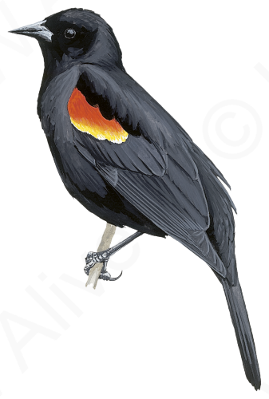\

Data from 52 RWBL that we caught in 2016 & 2017 in Ithaca between 18 April and 22 July. We tried to take a 7 point stress series with samples at 1, 3, 7, 15, 30, 45, 60 minutes. The exact time points vary a little bit though and we use the exact measures in all the plots and analyses. Some samples are also missing from the end or middle of some time series.

Note that I have removed one bird from early season that has an astronomically high cort value even starting at baseline and through the full series. It doesn't really make any qualitative difference, but including that bird just makes it hard to plot because it is so much higher than any others.

## Descriptive Plots

First, I'm just plotting the full stress series on the raw and log scale. There are a lot of possible choices here for how best to display this, so I'm dropping in a few different options at this point. The y axis scale is very different for the three breeding stages, which makes it hard to compare the shapes. There are a few options with changing the scales or log transforming or plotting in different facets that make it easier to compare.

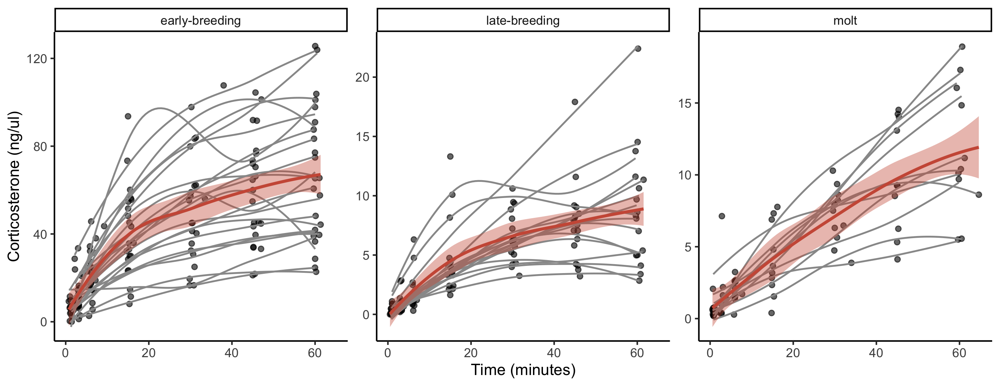\

**Figure x.** Time course of corticosterone measurements in each life history stage by individual (gray lines and points) and by group (red line and confidence interval). Note that y axes differ between the plots.

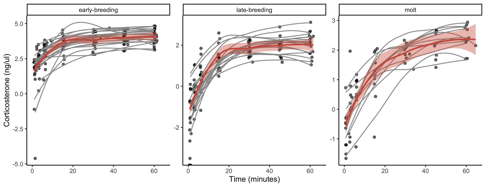\

**Figure x.** Same as above but on log scale.

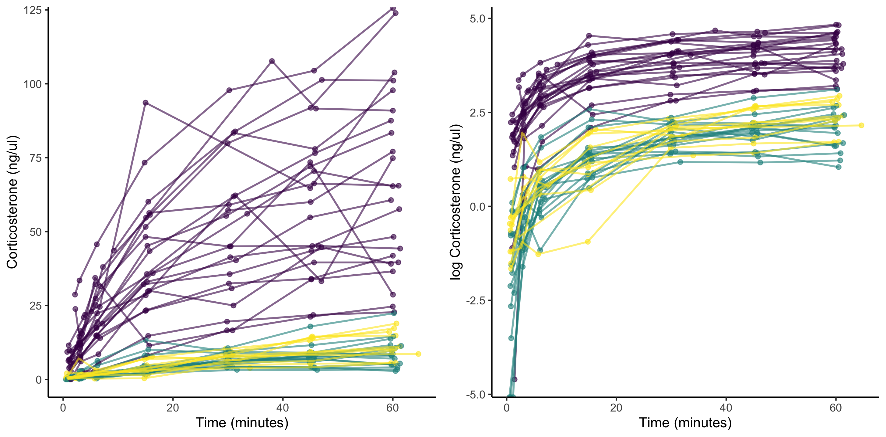\

**Figure x.** Lines on the same panels. Left is normal scale right is log scale.

## Response Shape by Life History

A lot of classic studies ask about differences in absolute cort values at different life history stages (e.g., find some Wingfield studies). We can see here that there are big differences between early breeding vs. late breeding vs. molt. For the most part, early breeding is higher than the other two across the board. We can also ask though whether the shape of the stress response differs or not between stages. For this I'm plotting the responses as a percentage of maximum for each individual over our seven point time series. This lets you see very clearly how the shape of the time course differs between stages.

I could do some actual statistics on this, but basically here you can see that:  
- Early breeders start with a baseline value that is already at a higher percentage of their maximum value.  
- Early & Late breeders achieve a higher percentage of their maximum value faster (i.e., they have a 'faster' cort response).  
- Molting birds achieve maximum value later (i.e., slower response).  
- As a result of those last two points, molting birds actually sustain their maximal *rate* of increase longer than the other stages.  

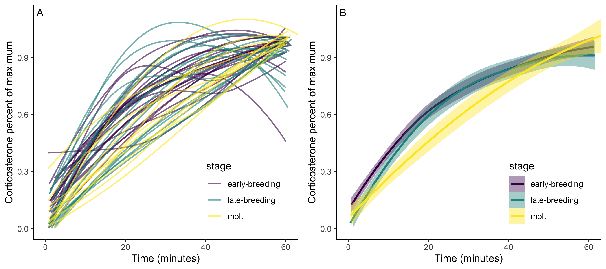\

**Figure x.** Time course of corticosterone as a percentage of maximum corticosterone achieved. Panel A shows loess regressions for each individual sampled. Panel B shows the combined loess regressions with 95% confidence interval for each life history stage.

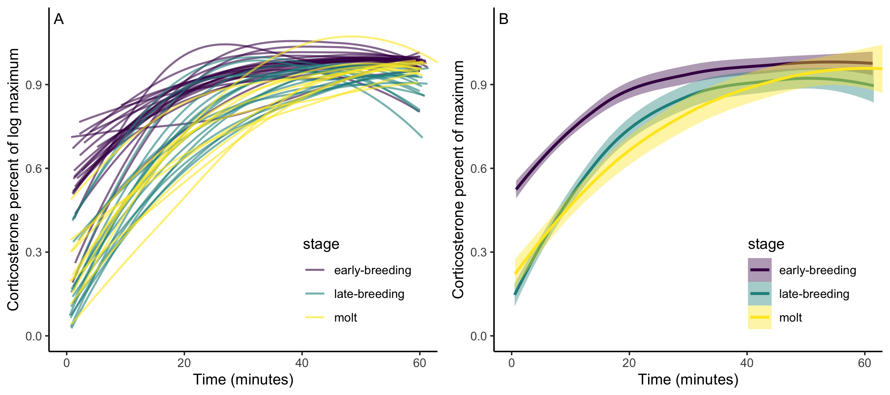\

**Figure x.** Same as above but on log scale.

## How much variation?

One thing that we might want to ask is just how much variation is there between individuals in the speed vs. the scope of cort responses? Is one more variable than the other? There might be different ways to get at this, but for now I'm just calculating the coefficient of variation for the slope, the time taken to reach 95% of maximal, and the maximal value (and baseline value) for each individual. Because the absolute values differ so much by stage I'm doing this separetly for each stage.

```{r}
cv_tab <- readRDS(here::here("3_r_scripts/cv_table.rds"))
knitr::kable(cv_tab, digits = 1, align = "lccccccc")
```

I don't love this way of comparing, but you can get a sense here of how much variation there is relative to the mean of each measure. It looks like there is at least a comparable amount of variation in initial slope as there is in max cort and maybe base cort has a bit more. In contrast, there isn't a huge amount of variation in the time it takes to reach 95% of maximal.

## Slope vs. Max

Here I'm asking whether the steepness of the initial slope of increase (in first 8 minutes) is correlated with the max cort value eventually achieved. Plotting both on the normal and on log scale and separately for the different life history stages. I'm not sure how much sense it really makes to look at this on the log scale, but I guess it is kind of what people are doing in a lot of analyses if they log transform without really thinking about it. Anyway, I'm plotting it just to look.

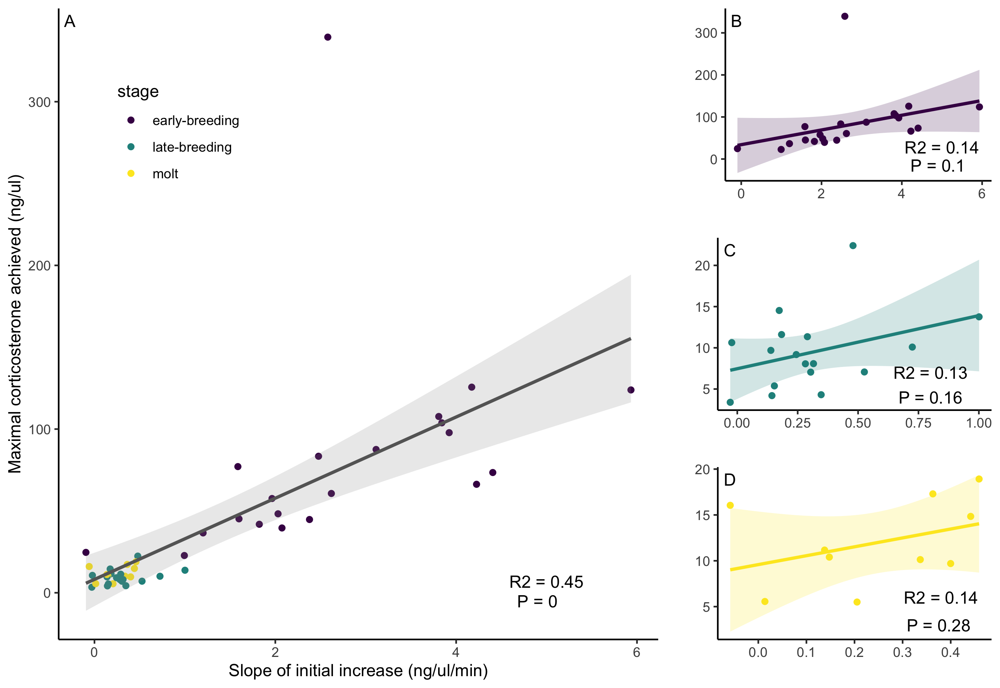\

**Figure x.** Relationship between the slope in the first three samples (~8 minutes) and the maximal corticosterone value achieved. Panel A shows all samples combined and B-D show the three stages separately. R2 and P values are from simple linear models. The one outlier with very high cort is included, I think excluding would make the early breeding relationship significant.

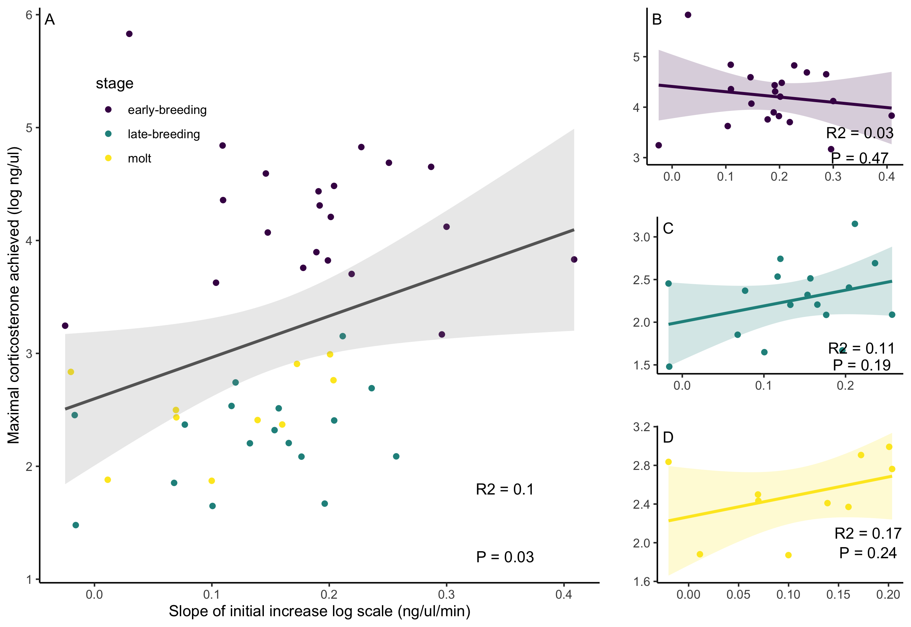\

**Figure x.** Same as above on log scale.

## Slope vs. Time to Max

Here I'm plotting the initial slope vs the elapsed time before each bird reached 95% of their maximal cort from the loess regressions. I do 95 rather than 100 because a lot of birds are still going up at the end of the 60 minutes. I guess it might be worth doing this at different numbers like 50 or 75% too...

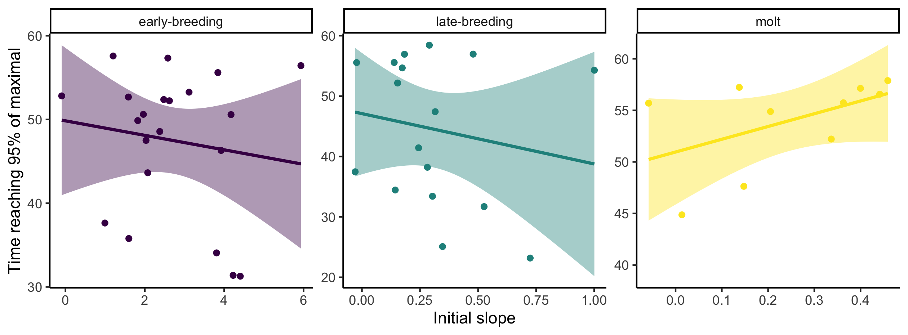\

**Figure x.** Normal scale

\

**Figure x.** Log scale

## Time to Max vs. Max

Here I'm plotting the max cort value reached vs. the time that individuals reached that value. Do individuals with the fastest cort responses also reach higher levels of circulating cort?

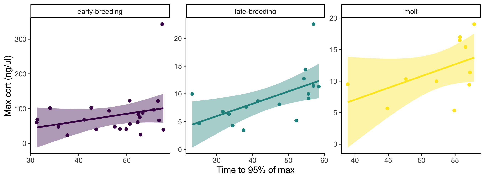\

**Figure x.** 

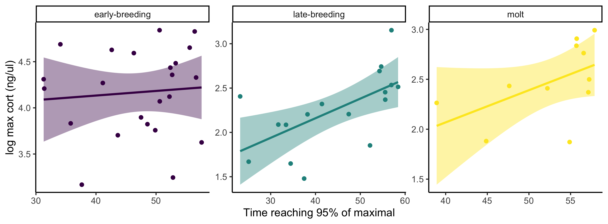\

**Figure x.**

## RWBL Conclusions

There are probably some different things we could do with the data above, but I think we can make some general conclusions relevant to the speed vs. scope question.  

+ In addition to varying in absolute cort measures across life stages, the actual shape of the cort response also seems to differ as life stage has slightly different effects on the speed vs. the scope of the cort response.  
+ Within a life history stage, there is variation within individuals in both the speed and scope of the cort response, and it isn't clear that one of these aspects is substantially more or less variable than the other.  
+ Pooling across contexts, the initial slope and maximal value of corticosterone are correlated, but the relationship is quite weak within each separate life stage, suggesting that the two can vary somewhat independently.  
+ There is little evidence that initial slope is directly related to time to achieving 95% of the maximal value, but the time series here does not capture the downward return to base cort and there was relatively little variation in the time required to reach 95%, so this may not be surprising. It may be better to look at the time to reach 70%, since that seems to be the part of the curve where individuals and stages differ most from each other.  
+ The time taken to reach maximal cort is related to the absolute value of max cort, but the relationship is positive. That means that birds that take longer to reach their max level also reach higher levels, presumably because they continue increasing for longer. That is really a problem for disentangling measure of speed and scope with time point measures.  
+ Measuring only at 30 minutes misses a lot of these features of the cort response.  

# Simulation

This is already described in more detail in the manuscript file I started, but basically the simulation works in two steps. I'm not sure it is worth making an actual package, but I could use some catchy function names. A package could be something like `cortResponse`. Right now my functions are just called `cort_sim1` and `cort_sim2`.

First, one function generates a population with 'true' values for base, speed, max, time at plateau, and time at return to base for each along with a 'performance' metric (i.e., fitness) that is derived from those true underlying values. I have now also added two additional parameters for the initial slope (a period of time with a potentially steeper slope in the first part of the response) and a 'fastpct' that defines what percentage of the total stress response (max - base) occurs during that steep initial slope period. You can set the mean and sd for each parameter, the number of animals to generate, and the degree of correlation between each parameter. Animals are then drawn from a multivariate normal distribution with the set values. Note that the function will allow you to set any values, but some combinations won't work if the produce negative values or if different traits are set to have strong correlations in a way that makes it impossible to generate a multivariate normal distribution; a message is given in these cases to try different values. I think I could extend this first function to also have slopes across a gradient for some parameters (e.g., the 'true' slope of response in base cort across a temperature gradient).

Second, the output from the first function is used to simulate corticosterone time courses for each animal (or multiple times for each animal). In this function you can set the degree of noise from the 'true' value for each parameter. This should be thought of as within-individual variation in cort response expression. You can also set an 'assay error'. This should be thought of as measurement error associated with the assay or pipetting, etc and it is only applied to the simulated dataset that is downsampled from the full timecourse to be measured at the set 'bleed times'. After this sampling, a loess smoothed curve is fit for each series of parameters for each animal and then 'cort' values are recorded at each minute of the full time course. The function saves a list with 1) the full time course for each sample, 2) a downsampled data set that has cort measured at just the selected time points (by default 2 & 30 minutes), and 3) a rank ordered time course to visualize the degree of crossing.

Using this simulation, we can explore a lot of different scenarios and ask how changing different parameters or sampling regimes might influence our ability to detect 'true' effects. There are actually so many possibilities here that I'm not sure what makes the most sense to focus on:  

- Sample different 'species' or 'populations' that have different shape, max, timing, or correlation between different parameters. Can you detect those differences? How much is ability to detect influenced by sampling regime?  
- Sample 1/2/3 time points. Can you detect speed vs. max separately? Change variation in time to reach max etc and see how that changes.  

This is a concept figure of what the simulation is doing:

\

## Demonstration

This is a demonstration of the output and plotting function for the simulation using all the default settings. I've been playing with what makes sense as defaults, but probably any individual study would want to change them for species specific values.

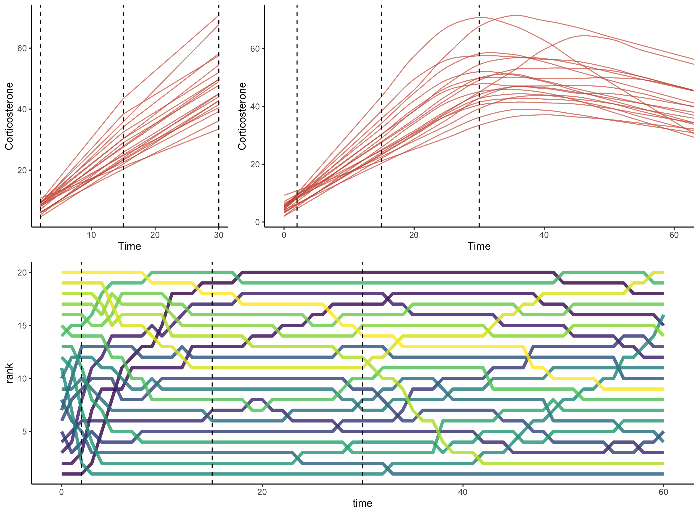\

In the default plot the three panels show  
1) The simulated dataset that is reduced to the defined sampling time points (2, 15, 30).  
2) The full time series dataset. This is fit with a loess curve from the 'true' values sampled with error. The 'wiggliness' can be adjusted.  
3) The rank profile of each animal over the time series.  

Below I'm mostly cropping plots at 60 minutes, but the time series goes out all the way to where the birds return to baseline, which is also sampled as part of the simulation. Like this:

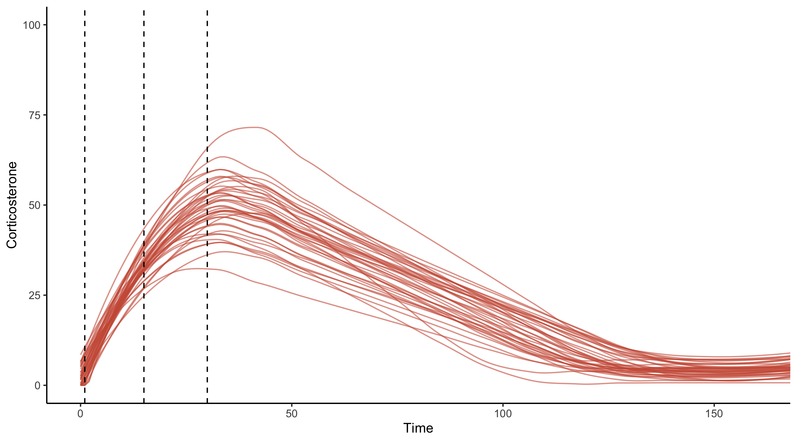\

## Relative variation in speed or scope

Measuring cort at 30 minutes at interpreting differences as variation in max cort implicitly assumes that variation in maxcort exists while variation in speed does not (or at least that it is so much smaller than max variation that it can be ignored). These three panels illustrate scenarios where cort is measured at 2, 15, and 30 minutes under different scenarios with respect to the amount of variation in speed or scope. In all three cases here, I assume that the population average maxcort is the same and that the average time to reach max cort is exactly 30 minutes (that means that we have timed our 30 minute sample perfectly for this population). Responses are measured with error, so even in cases where there is no 'true' variation, some between individual differences are visible. The correlation between all separate components of the curves are set to 0 here for simplicity. There are three scenarios:  

A) Max cort varies but there is no variation in speed.  
B) Both max cort and speed vary in reasonably comparable amounts.  
C) Max cort does not vary but speed does.

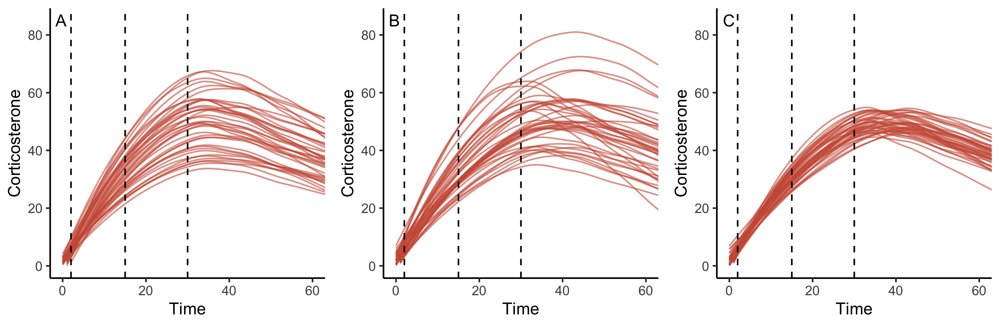\

Even though the sampling is the same in all three of these cases, the information encoded in the variation in cort levels at 15 and 30 minutes is very different.  

**Panel A** Both the 15 and 30 minute samples accurately reflect variation in max cort. Note though that the 15 minute measure actually does a better job of capturing the rank order of max cort (though not the absolute measure) because it is taken before any individuals have started to decline. At 30 minutes, the sample is still a reasonably good measure of max cort, but some individuals have started to decline already while others are going up. The estimate of average max cort on an absolute scale is better, but the individual ranks are at least a bit out of order. Note that this is driven by small differences in the amount of time individuals sustain their highest level and how long they take to return to baseline even in the absence of any underlying variation in the 'true' value of speed to reach max cort.

**Panel B** There is variation in both speed and max cort. Because speed and max cort are not correlated here, the measures at both 15 and 30 minutes are completely confounded between the two aspects and represent some combination of speed and scope that is likely impossible to disentangle without a more complete time series for each individual.

**Panel C** There is no variation in max cort, but ther is variation in the speed to reach maximum. At 15 minutes, there appears to be substantial variation in absolute cort level, but this is completely attributable to variation in the speed rather than maximum cort. At 30 minutes, even though we have timed our sample exactly at the population mean, our measure is not telling us much of anything because the variation is all in the speed of response and we are sampling a mix of individuals on the way up, at their plateau, and on the way down. In this case it would be better to have samples earlier than the mean population peak value if we were interested in understanding variation in speed.


## Correlation between speed and scope

Now consider the case of how much of a correlation there is between the speed and scope of the response.

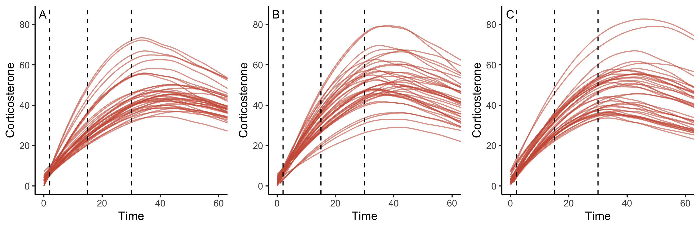\

**Panel A** Here speed and scope have a very strong positive correlation where faster responders also reach higher maximum values. This is good in some ways because it means that even though we can't tell speed and scope apart, by measuring one we are accurately measuring both (and maybe in this case you can just think of 'strong' responders as being both fast and high). This is a nice world, but we don't really have data to tell whether this is the world we are in.

**Panel B** Here this is like the one above where there is no correlation. Speed and scope are confounded and a high value at 15/30 minutes could either be because of a fast responder or a high maximum but you can't really tell which.

**Panel C** Here there is a strong correlation but in the other direction such that fast responders actually end up leveling off at lower maximal cort values. I think most people might assume this usually isn't the case, but in the RWBL data above, this is actually closer to what we see (though this is a stronger correlation just to illustrate). In this case, measures at 15/30 minutes that are interpretted as max cort values could be really misleading.

## Variation in speed but not max

Here is another illustration showing what happens if there is no variation in maximal cort coupled with different amounts of variation in speed (A -> C = adding more variation). In some cases (panel A), apparent variation in max at 30 minutes is really just measuring speed (but at least measuring it well). In others (Panel C), variation in 'max' at 30 minutes just isn't measuring anything, but still looks like there is individual variation.

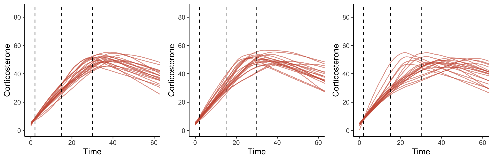\


 
# Extensions

Leaving notes here for myself. I think that I can pretty easily add:  

- Calculate and output area under the curve as a default based on whatever sampling points are chosen. This wouldn't be an additional parameter, but would change as a consequence of the parameters set above.  

- Make an extra function that will calculate profile repeatability (Reed & Romero 2019) from a simulated dataset with >1 sample drawn per individual. I *think* I can do this, but looking back quickly at how they actually calculated this, it is kind of a mess that involves counting the number of crossovers between time points. I might still be able to code it that way though, will have to look in more detail. 

- Given a set of parameters, could I make the function tell you the optimal times to collect x number of samples if you want to separately estimate speed and scope? Presumably you would want a couple early to get at rapid increase. But if there is very little variation in baseline cort then it might be better not to 'waste' a baseline measure? To really get time to max you kind of need a few samples pre/at/post max right?  

# Simulate RWBL Data

So one of the major challenges to disentangling speed and scope is just getting a better handle on how to parameterize these shapes for different species. How much variation is there in when individuals reach their max? How does that compare to variation in the max value itself? How do the relative contributions of those different parameters influence our ability to detect causal relationships between underlying traits and fitness when we only have measurements taken with error?

There are a lot of ways we could play with this simulator to address those questions, but they involve a lot of guesswork. I think one promising approach that makes sense here is to start with the empirical data from the RWBL dataset that has a (relatively) fine scale time course measured and create a simulation that produces similar curves. Then we can ask how easily we can identify relationships between cort phenotype and fitness from the simulated data.

Here is an attempt at that where I have tweaked the simulation parameters until I produce curves that look qualitatively like the RWBL data. I've collected the data with the same 7 point time series as we used in the empirical study, but we also have access to the full time course and the true values underlying it. For simplicity, I'm only using the early season records from RWBL.

Like in the empirical data above, I've encoded a positive correlation between the initial slope and the max cort value achieved. All other traits are left uncorrelated.

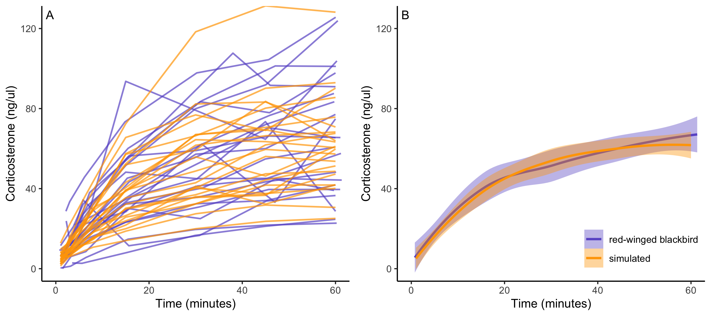\

**Figure x.** Simulated data plotted against red-winged blackbird data from the early breeding season. Simulated data are sampled at 7 time points corresponding to those used in the empirical study and plotted by animal (panel A) and with a smoothed curve and confidence interval for the simulated versus empirical data (panel B). 

So this does a good job of simulating data that looks like the RWBL data. Next lets use that as a starting point to explore whether we can recover relationships between speed, scope and performance.

## Scenario 1: Speed predicts performance

In this first scenario, I'm simulating the data with the same parameters as above. We'll take a population of 50 animals, with cort measured at 30 and 55 minutes (since 55 is the average max time here). Speed of the cort response explains 50% of the variation in performance, scope explains 0%, and the other 50% is random.


- Scenarios to point out:

If there is any variation in speed, observed repeatability in basecort can be entirely attributable to speed even if there is 0 variation in basecort. This situation may be better if there really is a lag between capture and increase, but how do you assess if there is individual variation in the time of that lag?


