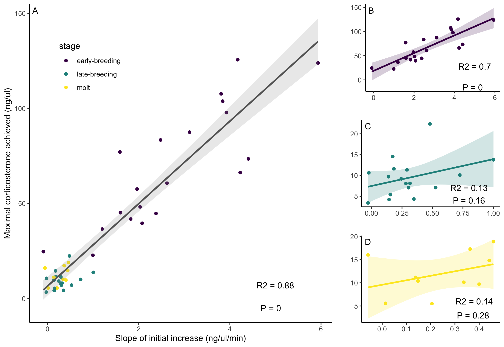
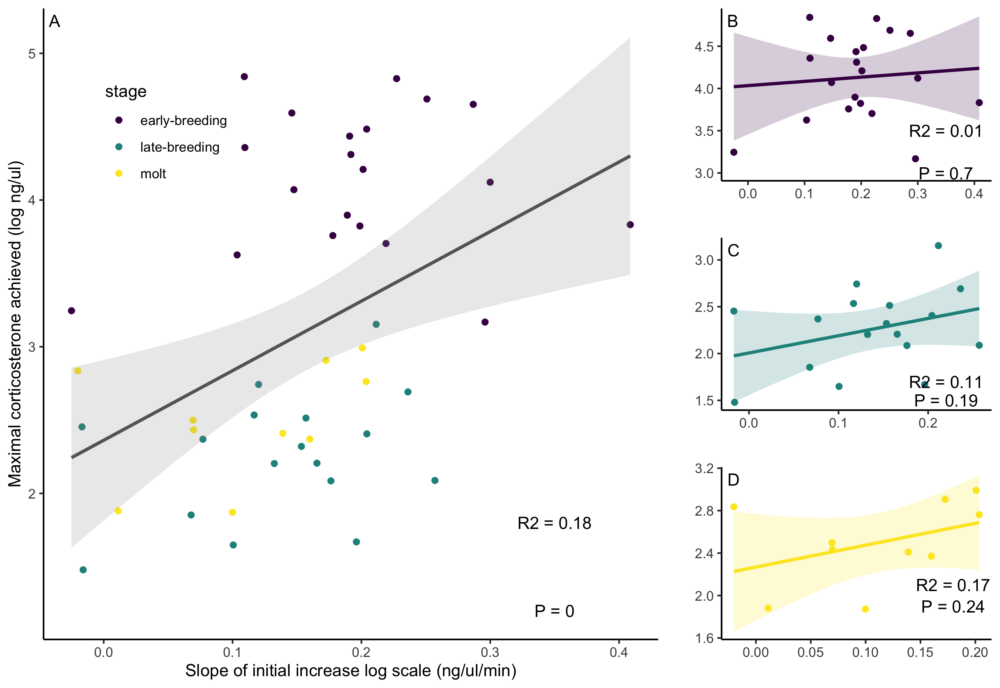
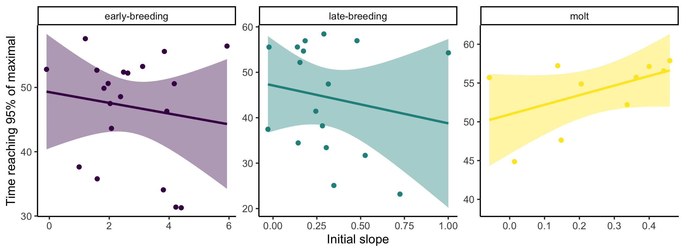
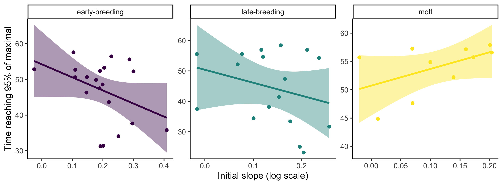
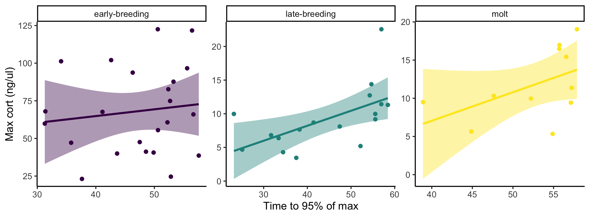

```{r setup, include=FALSE}
knitr::opts_chunk$set(echo = TRUE)
```

# Red-Winged Blackbird Analysis

\

Data from 52 RWBL that we caught in 2016 & 2017 in Ithaca between 18 April and 22 July. We tried to take a 7 point stress series with samples at 1, 3, 7, 15, 30, 45, 60 minutes. The exact time points vary a little bit though and we use the exact measures in all the plots and analyses. Some samples are also missing from the end or middle of some time series.

## Descriptive Plots

First, I'm just plotting the full stress series on the raw and log scale. There are a lot of possible choices here for how best to display this, so I'm dropping in a few different options at this point. The y axis scale is very different for the three breeding stages, which makes it hard to compare the shapes. There are a few options with changing the scales or log transforming or plotting in different facets that make it easier to compare.

\

**Figure x.** Time course of corticosterone measurements in each life history stage by individual (gray lines and points) and by group (red line and confidence interval). Note that y axes differ between the plots.

\

**Figure x.** Same as above but on log scale.

\

**Figure x.** Lines on the same panels. Left is normal scale right is log scale.

## Response Shape by Life History

A lot of classic studies ask about differences in absolute cort values at different life history stages (e.g., find some Wingfield studies). We can see here that there are big differences between early breeding vs. late breeding vs. molt. For the most part, early breeding is higher than the other two across the board. We can also ask though whether the shape of the stress response differs or not between stages. For this I'm plotting the responses as a percentage of maximum for each individual over our seven point time series. This lets you see very clearly how the shape of the time course differs between stages.

I could do some actual statistics on this, but basically here you can see that:  
- Early breeders start with a baseline value that is already at a higher percentage of their maximum value.  
- Early & Late breeders achieve a higher percentage of their maximum value faster (i.e., they have a 'faster' cort response).  
- Molting birds achieve maximum value later (i.e., slower response).  
- As a result of those last two points, molting birds actually sustain their maximal *rate* of increase longer than the other stages.  

\

**Figure x.** Time course of corticosterone as a percentage of maximum corticosterone achieved. Panel A shows loess regressions for each individual sampled. Panel B shows the combined loess regressions with 95% confidence interval for each life history stage.

\

**Figure x.** Same as above but on log scale.

## How much variation?

One thing that we might want to ask is just how much variation is there between individuals in the speed vs. the scope of cort responses? Is one more variable than the other? There might be different ways to get at this, but for now I'm just calculating the coefficient of variation for the slope, the time taken to reach 95% of maximal, and the maximal value (and baseline value) for each individual. Because the absolute values differ so much by stage I'm doing this separetly for each stage.

```{r}
cv_tab <- readRDS(here::here("3_r_scripts/cv_table.rds"))
knitr::kable(cv_tab, digits = 1, align = "lccccccc")
```

I don't love this way of comparing, but you can get a sense here of how much variation there is relative to the mean of each measure. It looks like there is at least a comparable amount of variation in initial slope as there is in max cort and maybe base cort has a bit more. In contrast, there isn't a huge amount of variation in the time it takes to reach 95% of maximal.

## Slope vs. Max

Here I'm asking whether the steepness of the initial slope of increase (in first 8 minutes) is correlated with the max cort value eventually achieved. Plotting both on the normal and on log scale and separately for the different life history stages. I'm not sure how much sense it really makes to look at this on the log scale, but I guess it is kind of what people are doing in a lot of analyses if they log transform without really thinking about it. Anyway, I'm plotting it just to look.

\

**Figure x.** Relationship between the slope in the first three samples (~8 minutes) and the maximal corticosterone value achieved. Panel A shows all samples combined and B-D show the three stages separately. R2 and P values are from simple linear models. The one outlier with very high cort is included, I think excluding would make the early breeding relationship significant.

\

**Figure x.** Same as above on log scale.

## Slope vs. Time to Max

Here I'm plotting the initial slope vs the elapsed time before each bird reached 95% of their maximal cort from the loess regressions. I do 95 rather than 100 because a lot of birds are still going up at the end of the 60 minutes. I guess it might be worth doing this at different numbers like 50 or 75% too...

\

**Figure x.** Normal scale

\

**Figure x.** Log scale

## Time to Max vs. Max

Here I'm plotting the max cort value reached vs. the time that individuals reached that value. Do individuals with the fastest cort responses also reach higher levels of circulating cort?

\

**Figure x.** 

\

**Figure x.**

## RWBL Conclusions

There are probably some different things we could do with the data above, but I think we can make some general conclusions relevant to the speed vs. scope question.  

+ In addition to varying in absolute cort measures across life stages, the actual shape of the cort response also seems to differ as life stage has slightly different effects on the speed vs. the scope of the cort response.  
+ Within a life history stage, there is variation within individuals in both the speed and scope of the cort response, and it isn't clear that one of these aspects is substantially more or less variable than the other.  
+ Pooling across contexts, the initial slope and maximal value of corticosterone are correlated, but the relationship is quite weak within each separate life stage, suggesting that the two can vary somewhat independently.  
+ There is little evidence that initial slope is directly related to time to achieving 95% of the maximal value, but the time series here does not capture the downward return to base cort and there was relatively little variation in the time required to reach 95%, so this may not be surprising. It may be better to look at the time to reach 70%, since that seems to be the part of the curve where individuals and stages differ most from each other.  
+ The time taken to reach maximal cort is related to the absolute value of max cort, but the relationship is positive. That means that birds that take longer to reach their max level also reach higher levels, presumably because they continue increasing for longer. That is really a problem for disentangling measure of speed and scope with time point measures.  
+ Measuring only at 30 minutes misses a lot of these features of the cort response.  

# Simulation

This is already described in more detail in the manuscript file I started, but basically the simulation works in two steps. I'm not sure it is worth making an actual package, but I could use some catchy function names. A package could be something like `cortResponse`. Right now my functions are just called `cort_sim1` and `cort_sim2`.

First, one function generates a population with 'true' values for base, speed, max, time at plateau, and time at return to base for each along with a 'performance' metric (i.e., fitness) that is derived from those true underlying values. You can set the mean and sd for each parameter, the number of animals to generate, and the degree of correlation between each parameter. Animals are then drawn from a multivariate normal distribution with the set values. Note that the function will allow you to set any values, but a lot of combinations won't work if the produce negative values or if different traits are set to have strong correlations in a way that makes it impossible to generate a multivariate normal distribution; a message is given in these cases to try different values. I think I could extend this first function to also have slopes across a gradient for some parameters (e.g., the 'true' slope of response in base cort across a temperature gradient).

Second, the output from the first function is used to simulate corticosterone time courses for each animal (or multiple times for each animal). In this function you can set the degree of error from the 'true' value for each parameter. This can be thought of as measurement error or as individual variation associated with repeat sampling of the same animal. After this sampling, a loess smoothed curve is fit for each series of parameters for each animal and then 'cort' values are recorded at each minute of the full time course. The function saves a list with 1) the full time course for each sample, 2) a downsampled data set that has cort measured at just the selected time points (by default 2 & 30 minutes), and 3) a rank ordered time course to visualize the degree of crossing.

Using this simulation, we can explore a lot of different scenarios and ask how changing different parameters or sampling regimes might influence our ability to detect 'true' effects. There are actually so many possibilities here that I'm not sure what makes the most sense to focus on:  

- Sample different 'species' or 'populations' that have different shape, max, timing, or correlation between different parameters. Can you detect those differences? How much is ability to detect influenced by sampling regime?  
- Sample 1/2/3 time points. Can you detect speed vs. max separately? Change variation in time to reach max etc and see how that changes.  

## Demonstration

This is a demonstration of the output and plotting function for the simulation using all the default settings. I've been playing with what makes sense as defaults, but currently this is set such that:  

+ Base cort is 

\

In the default plot the three panels show  
1) The simulated dataset that is reduced to the defined sampling time points (2, 15, 30).  
2) The full time series dataset. This is fit with a loess curve from the 'true' values sampled with error. The 'wiggliness' can be adjusted.  
3) The rank profile of each animal over the time series.  


## Speed vs. Scope


